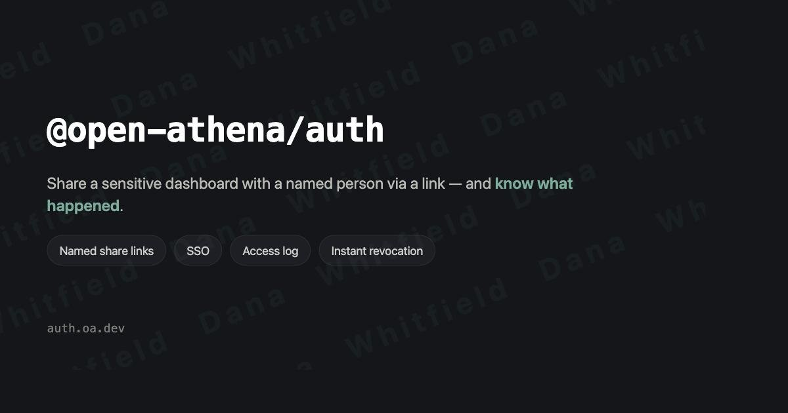

# `@open-athena/auth`

> Named share links, SSO, and an access log for gated dashboards.

Reusable auth layers for apps with the "public site, gate a slice" shape: a backend kernel (HMAC sessions + DB-backed grant tokens, an SSO IdP adapter) and source-agnostic React FE primitives (`useWhoami` / `AuthGate` / `SignInPanel` / `WhoamiChip`).

Mint a link, name it after the person you're sending it to, set how many times and how long it works, and see what they looked at. SSO for staff; request-access for everyone else.

Extraction target for the shipped implementations in [watchy] (Tier-2 reference), [marin-gcs-usage] (Tier 1), [mortgage-viz] (grants/nonce substrate), and applitrack (allowlist table).

Scope note: this is *gating* — sessions, SSO hand-off, share links, request-access, audit — not a general-purpose auth framework (no password store, no OAuth server, no RBAC engine).

## Try it: **[auth.oa.dev](https://auth.oa.dev)**

Get a throwaway sandbox, mint a named link, open it, watch its access log fill in — then revoke it and watch the session die on its next request. No account needed.



## Status

Backend kernel, request-access, the HTTP route surface, the React primitives, and the §4 analytics work (beacon, bot filtering, retention rollup) are **implemented and covered by 163 tests**, and deployed at [auth.oa.dev](https://auth.oa.dev). Next up: adoption — see `specs/adoption.md`.

- [`demo/`](demo/) — the deployed app: mint a link, watch its access log, revoke it and see the session die
- [`specs/adoption.md`](specs/adoption.md) — which repos should adopt this, in what order, and what each costs
- [`specs/overview.md`](specs/overview.md) — two-tier model, layer split, packaging
- [`specs/share-links-and-audit.md`](specs/share-links-and-audit.md) — share-link config, request-access, access log, analytics

## Layout

`core/` is runtime-agnostic — Web Crypto and a SQL-shaped store interface, nothing else. The Cloudflare coupling is exactly two adapters, kept as a *file boundary* rather than an abstraction layer (no plugin registry, no DI):

```
src/core/       sessions, tokens, grants, policy, requests, audit, routes — no CF, no Node
src/adapters/   d1.ts (grant + request stores, audit sink & queries), cf-access.ts (SSO IdP)
src/react/      useWhoami / AuthGate / SignInPanel / WhoamiChip / disclosure — unstyled
migrations/     grants, access_log, access_requests, access_log_daily
demo/           a working Tier-2 app on Pages + Functions + D1
```

Peers of `adapters/d1` are any SQLite (Turso, better-sqlite3) or Postgres; peers of `adapters/cf-access` are Google/GitHub OIDC, WorkOS, or no IdP at all. Every current consumer is on CF, so those stay the only two adapters until a non-CF consumer appears.

## Installing

Not on npm yet — it ships as a **`dist` branch**, consumed by SHA (the [`npm-dist`] model other OA/personal libs use). npm comes once the API has stopped moving; the scope is registered and waiting.

```bash
pds gh auth            # if the dep is already pds-managed
```

or by hand, pinning a SHA rather than the branch so a consumer's build is reproducible:

```bash
SHA=$(gh api repos/Open-Athena/auth/commits/dist --jq .sha)
pnpm add "@open-athena/auth@github:Open-Athena/auth#$SHA"
```

The `dist` branch only advances on a commit whose tests passed, and CI then installs the published branch and exercises it (`scripts/verify-dist.mjs`) — so any SHA you can pin is green *as an artifact*, not just as source. It carries built JS + `.d.ts`, the migrations, and the peer-dep declarations; versions read `0.1.0-dist.<sha>`.

Peer deps are all optional and only needed for what you use: `@cloudflare/workers-types` (types only), and `react` + `@tanstack/react-query` for the `/react` subpath.

## Quickstart

Apply the migrations, then build a gate:

```ts
import { createGate, domainPolicy, hasScope } from '@open-athena/auth'
import { d1AuditSink, d1GrantStore } from '@open-athena/auth/d1'

const gate = createGate({
  store: d1GrantStore(env.DB),
  audit: d1AuditSink(env.DB),
  secret: env.SESSION_SECRET,
  adminEmails: ['boss@openathena.ai'],
  policy: domainPolicy(['openathena.ai'], ['internal']),
})

const auth = await gate.authenticate(request)
if (!auth || !hasScope(auth, 'internal')) return new Response('nope', { status: 401 })
```

`authenticate` accepts a session cookie, `Authorization: Bearer <token>`, or `?key=<token>` — the latter two let curl and scripts skip the cookie exchange.

**Share links.** Mint one, hand out the raw token exactly once (only its hash is stored), and let the browser trade it for a session:

```ts
const { grant, token } = await gate.mint({
  name: 'Bob Smith (donor)',
  scopes: ['reports'],
  expiresAt: Math.floor(Date.now() / 1000) + 30 * 86400,
  createdBy: auth.email,
})
// -> https://dash.example.org/?key=<token>

const res = await gate.redeem(token, request)   // POST /auth/exchange
if (res.ok) return new Response(null, { headers: { 'set-cookie': res.cookie } })
```

Every knob is optional; zero-config is an unlimited-use, never-expiring, unnamed link. `maxRedeems` counts **sessions minted** (≈ distinct browsers), not requests — which is what makes "one-use link" mean what a human predicts. Note that `maxRedeems: 1` is hostile UX in practice (the recipient opens it on their phone, then their laptop, and is locked out); prefer unlimited-redeem, named, logged, and revocable.

**SSO.** Point one CF Access application at `/auth/sso` and leave the rest of the site public at the edge:

```ts
import { ssoHandler } from '@open-athena/auth/cf-access'

export const onRequest = ssoHandler({ gate, teamDomain: 'https://acme.cloudflareaccess.com', aud: env.ACCESS_AUD })
```

**Revocation is instant.** Grant-backed sessions re-join their grant row on every request, so `gate.revoke(id)` kills every session that link ever minted — no waiting out a cookie TTL. That property is what makes the social story work: assume links get forwarded, and design so forwarding is *visible and revocable* rather than prevented.

**The access log** is one store for auth-lifecycle events and (optionally) views, so "who viewed what" joins to `grants` natively. Lifecycle events always log; `view` events are deduped per (session, path, hour) by a partial unique index, and are **off by default** — turn them on alongside the "access is logged" disclosure copy, not silently. Client IPs are never stored, only `HMAC(ip, secret)`.

**Mounting it.** `authRoutes(gate, opts)` is a whole `/api/auth/*` surface — whoami, exchange, logout, request-access, and admin grant/request/log routes — returning `null` for paths it doesn't own so your router can fall through. `creatorOf`/`scopeToCreator` confine an admin to their own grants, which is how the demo lets strangers share one deployment.

**On the frontend**, `@open-athena/auth/react` ships the logic and leaves the presentation to you — every string and class is a prop, and no CSS is bundled:

```tsx
<AuthGate
  source={{ kind: 'app' }}          // or { kind: 'edge' } for Tier 1 — the only line that changes
  signIn={<SignInPanel signInUrl="/auth/sso" requestAccess />}
>
  {whoami => <>
    <AccessNotice whoami={whoami} />   {/* "Private link for Bob Smith · access is logged" */}
    <Dashboard />
  </>}
</AuthGate>
```

## Development

```bash
pnpm install
pnpm test        # vitest; core runs against an in-memory store, adapters against node:sqlite
pnpm typecheck
pnpm build
cd demo && pnpm dev    # the whole thing running, on :4187
```

`pnpm build` compiles `src/core` and `src/adapters` against `@cloudflare/workers-types` alone (no Node types), which is what keeps them honest about being runtime-agnostic. `src/react` is a separate compilation because DOM lib and workers-types declare conflicting globals.

[`npm-dist`]: https://github.com/runsascoded/npm-dist
[watchy]: https://github.com/runsascoded/watchy
[marin-gcs-usage]: https://github.com/Open-Athena/marin-gcs-usage
[mortgage-viz]: https://github.com/runsascoded/mortgage-viz
